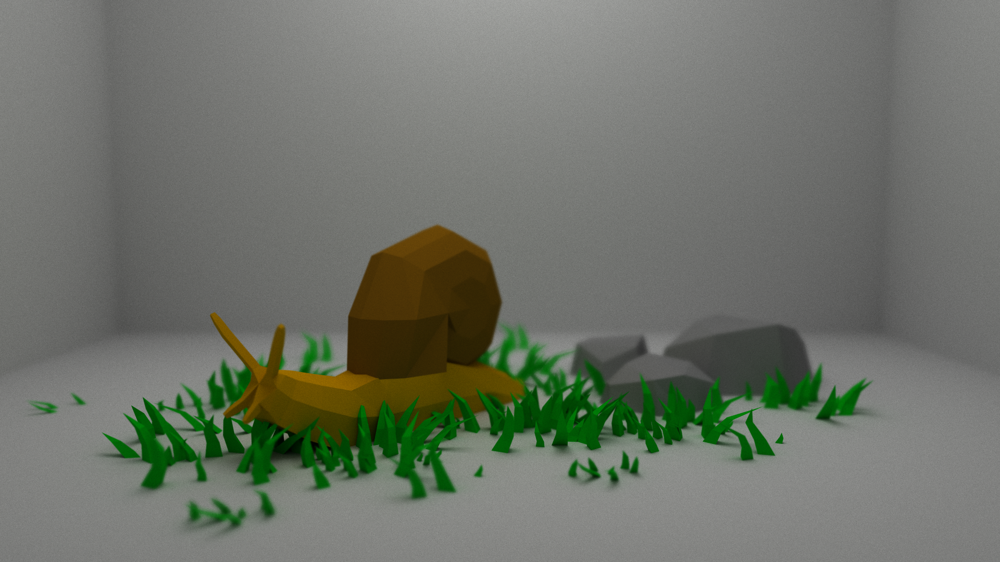

# Caracol



_Caracol_ is my very own slow raytracer. It was inspired by Sebastian Lague's [video](https://www.youtube.com/watch?v=Qz0KTGYJtUk) and written in Rust. Some of my other sources include the famous [Raytracing in One Weekend series](https://raytracing.github.io/), [How to build a BVH](https://jacco.ompf2.com/2022/04/13/how-to-build-a-bvh-part-1-basics/), a myriad of YouTube videos on geometry, and many ChatGPT prompts.

While not built for speed, _Caracol_ features a BVH built according to the Surface Area Heuristics and some BVH traversal optimizations. `rayon` made parallelization very easy, so I added that too.

## Running

To render the default scene,

```bash
cargo build --release
target/release/caracol
```

To change the scene or its settings, modify `src/config.rs`. _Caracol_ has some (very) basic support for `.obj` files via the `read_obj` function. This function does not handle rotations, translations or scaling, and you can only assign one material to the entire object. Since scene handling is limited, I prepare scenes in Blender and export each object into its own `.obj` file.

## Other Scenes

Here's the [famous](https://engineering.stanford.edu/news/tale-ubiquitous-stanford-bunny) Stanford Bunny in a Cornell Box. This image (a 512x512 image with 2000 rays per pixel) takes about six minutes to render in my computer. The Bunny has 69451 triangles.


## Acknowledgments

- Snail by Poly by Google [CC-BY](https://creativecommons.org/licenses/by/3.0/) [via Poly Pizza](https://poly.pizza/m/aZ_cT-AIu2y)
- grass mix by Steve B [CC-BY](https://creativecommons.org/licenses/by/3.0/) [via Poly Pizza](https://poly.pizza/m/2zt43AlwVoI)
- Rocks by Quaternius via [Poly Pizza](https://poly.pizza/m/OQvi8PIZ40)
- Stanford Bunny by [Stanford University Computer Graphics Laboratory](https://graphics.stanford.edu/data/3Dscanrep/)
